# Phần A
## Câu A1
1. Inline CSS (Nhúng trong attribute style)
Ví dụ chuẩn từ bài học: <h1 style="color: #2563eb; font-size: 32px;">Tiêu đề</h1>

Ưu/Nhược điểm & Bản chất: Không tái sử dụng được, khó maintain. Không thể cache, buộc trình duyệt phải tải lại ở mỗi lượt page load.

Khi nào nên dùng: Chỉ dùng khẩn cấp hoặc cần override (ghi đè) tạm thời.

2. Internal CSS (Nhúng trong thẻ 
</head>
Ưu/Nhược điểm & Bản chất: Chỉ dùng được cho 1 trang riêng biệt, khiến nội dung và giao diện bị dính liền trong 1 file HTML.

Khi nào nên dùng: Chấp nhận dùng khi làm Prototype (bản nháp trực quan) hoặc các trang đơn (Single-page).

3. External CSS (Nhúng file .css riêng biệt)
Ví dụ chuẩn từ bài học:

HTML
<head>
    <link rel="stylesheet" href="styles.css">
</head>
Trong file styles.css: h1 { color: #2563eb; font-size: 32px; }

Ưu điểm vượt trội (Bắt buộc dùng cho Production):

Caching: Trình duyệt cache file CSS sau lần đầu tải, sang trang thứ 2, 3 không cần tải lại nữa -> Tăng tốc độ load.

Tái sử dụng: 50 trang dùng chung 1 file, sửa 1 chỗ là đổi toàn bộ hệ thống website.

Tách biệt cấu trúc (HTML) và giao diện (Presentation) giúp team làm việc song song hiệu quả.

Performance: Có thể nén nhỏ file (Minified CSS như file main.min.css) giúp tối ưu băng thông.

Khi nào nên dùng: Chuẩn Production — Bắt buộc áp dụng cho mọi dự án thực tế.

Đối chiếu câu hỏi phụ (Cái nào thắng?): Tài liệu khẳng định Inline CSS có mức độ ưu tiên cao nhất về mặt Bản chất đặc hiệu (Specificity). Do đó nếu cùng áp dụng vào 1 phần tử, Inline CSS sẽ "thắng" Internal và External. , nhưng nếu chỉ có Internal và External thì thằng nào nằm dưới sẽ thắng do ghi đè thằng ở trên

## Câu A2
Câu A2 — CSS Selectors — Dự đoán kết quả
Dựa vào cấu trúc HTML được cung cấp, các selector sẽ chọn các phần tử cụ thể sau:

1. h1 → Chọn: ShopTLU

2. price → Chọn: 25.990.000đ và 45.990.000đ

3. #app header → Chọn toàn bộ khối header bao gồm các text: ShopTLU, Home, Products, About

4. nav a:first-child → Chọn: Home

5. product.featured h2 → Chọn: MacBook Pro

6. article > p → Chọn các đoạn văn là con trực tiếp của article: 25.990.000đ, Mô tả sản phẩm..., 45.990.000đ, Mô tả sản phẩm...

7. a[href="/"] → Chọn: Home

8. .top-bar.dark h1 → Chọn: ShopTLU
Ảnh kiểm chứng 

## Câu A3
1. Trường hợp mặc định: box-sizing: content-box Trong chế độ này, giá trị width: 400px chỉ áp dụng cho phần nội dung (Content) bên trong cùng. Các lớp còn lại sẽ đắp thêm vào bên ngoài.Chiều rộng hiển thị trên trình duyệt (Visual Width):Đây là phần bạn nhìn thấy (bao gồm cả màu nền và đường viền)
Chiều rộng hiển thị trên trình duyệt 400px(width) + 20 px * 2 (padding) + 5px * 2(border)=450px
Không gian chiếm trên trang: 450px{px (chiều rộng hiển thị)} + 10px * 2(margin)= 470px

2. 
Chiều rộng hiển thị = 400px , Nhờ có box-sizing: border-box, chiều rộng hiển thị  của phần tử được cố định đúng bằng giá trị width  khai báo, bao gồm cả phần đệm và đường viền
Kích thước content thực tế = 350px . Công thức tính: Width - Padding (trái + phải) - Border (trái + phải) = 400px - (20px * 2) - (5px * 2) = 350px
Không gian chiếm trên trang = 420px . Công thức tính: Chiều rộng hiển thị + Margin (trái + phải) = 400px + (10 * 2) = 420px

3. Trường hợp 3: Margin collapse (Sụp đổ lề)CSS.box-a { margin-bottom: 25px; }
.box-b { margin-top: 40px; }
Khoảng cách giữa box-a và box-b = 40px
Giải thích tại sao KHÔNG PHẢI 65px :
Theo cơ chế mặc định của trình duyệt, khi hai lề dọc (top/bottom) của hai khối kề nhau tiếp xúc trực tiếp, chúng sẽ xảy ra hiện tượng sụp đổ lề.Thay vì cộng dồn hai giá trị lại với nhau (25px + 40px = 65px), trình duyệt sẽ thực hiện một phép so sánh và chỉ chọn giá trị lề lớn nhất để áp dụng (trong trường hợp này là 40px của .box-b). Phần lề 25px của .box-a sẽ  hoàn toàn bên trong khoảng không gian 40px đó.

Nâng cao: Nếu .box-a có margin-bottom: -10px và .box-b có margin-top: 40px, khoảng cách thực tế sẽ tính bằng tổng đại số của lề dương lớn nhất và lề âm nhỏ nhất: 40px + (-10px) = 30px 

## Câu A4
1. Tính specificity score (a, b, c) cho mỗi rule
Công thức tính Specificity thường được biểu diễn dưới dạng (a, b, c), trong đó:

a: Số lượng ID selectors.

b: Số lượng Class, Attributes, và Pseudo-classes selectors.

c: Số lượng Element và Pseudo-elements selectors.
Dựa vào công thức trên, ta có điểm số cho từng rule như sau:
Rule A (p): Chỉ có 1 thẻ element. Điểm: (0, 0, 1)
Rule B (.price): Chỉ có 1 class.Điểm: (0, 1, 0)
Rule C (#main-price): Chỉ có 1 ID. Điểm: (1, 0, 0) 
Rule D (p.price): Có 1 thẻ element (p) và 1 class (.price). Điểm: (0, 1, 1)

2. Element sẽ có màu đỏ (red).
Giải thích: Trình duyệt sẽ so sánh điểm specificity từ trái sang phải (a-b-c).
Rule C có điểm a cao nhất (1 > 0), nên tổng thể điểm (1, 0, 0) là lớn nhất trong 4 rules.
ID selector luôn có sức mạnh áp đảo so với Class hay Element selector. Do đó, CSS của Rule C được ưu tiên áp dụng.

3. Nếu thêm 
, element có màu gì?
Màu của element: Lần này element sẽ có màu cam (orange).

Giải thích: Khai báo trực tiếp trong thẻ HTML bằng thuộc tính style="..." được gọi là Inline Style. Inline style không nằm trong công thức (a, b, c) mà nó nằm ở một bậc ưu tiên cao hơn hẳn (thường được ví như cột thứ 4: 1, 0, 0, 0). Do đó, nó sẽ ghi đè mọi CSS khai báo bằng ID, Class hay Element trong file .css (ngoại trừ trường hợp có !important).

4. Nếu Rule A thêm !important, element có màu gì? Tại sao?
Màu của element: Element sẽ có màu đen (black).

Tại sao: Từ khóa !important là một ngoại lệ đặc biệt trong CSS. Khi một thuộc tính được gắn !important, nó sẽ bỏ qua hoàn toàn các quy tắc tính điểm specificity thông thường. Nó sở hữu quyền lực tối cao nhất, ghi đè lên cả ID selector và thậm chí ghi đè lên cả Inline Style. Do đó, dù Rule A chỉ có điểm (0, 0, 1), phần tử vẫn sẽ bị ép lấy màu đen.

# Phần C
## Câu C1
1. Tính chiều rộng thực tế của sidebar và content (content-box)
Theo mặc định (box-sizing: content-box), thuộc tính width chỉ áp dụng cho phần lõi (content). Chiều rộng thực tế chiếm dụng trên màn hình phải cộng thêm cả padding và border (trái + phải).

Chiều rộng thực tế của .sidebar:
300px (width) + 20px (padding-left) + 20px (padding-right) + 1px (border-left) + 1px (border-right) = 342px

Chiều rộng thực tế của .content:
660px (width) + 30px (padding-left) + 30px (padding-right) + 1px (border-left) + 1px (border-right) = 722px

2. Giải thích tại sao layout bị vỡ
Layout bị vỡ (phần content bị rớt xuống dòng) là do một phép toán rất đơn giản:

Tổng không gian cần thiết cho 2 khối: 342px + 722px = 1064px.

Tuy nhiên, .container cha lại bị khóa cứng ở mức: 960px.

Vì 1064px > 960px, không đủ chỗ trống trên cùng một hàng, trình duyệt bắt buộc phải đẩy khối .content (nằm sau) rớt xuống dòng tiếp theo để có đủ không gian hiển thị.

3. Đưa ra 2 cách sửa khác nhau
Cách 1: Sử dụng border-box (Cách hiện đại, khuyên dùng)Chúng ta ép trình duyệt tính cả padding và border vào trong kích thước khai báo ban đầu. Lúc này, tổng chiều rộng thực tế sẽ tự động khớp đúng với width bạn viết.
Thêm box-sizing: border-box; vào cả .sidebar và .content.
(300px + 660px = đúng 960px của container).
Cách 2: Không dùng border-box (Cách cổ điển, tính toán thủ công)
Chúng ta giữ nguyên mặc định content-box, nhưng phải gọt bớt thuộc tính width đi một lượng bằng đúng tổng padding và border đã thêm vào.
Sidebar mới: Cần tổng là 300px ,  width = 300 - 40 (padding) - 2 (border) = 258px.
Content mới: Cần tổng là 660px , width = 660 - 60 (padding) - 2 (border) = 598px.

## Câu C2
Phần 1: Trả lời & Giải thích quá trình Cascade + Inheritance
1. "Sản phẩm A" (<h2 class="title highlight">)
font-size = 20px

Giải thích: Trình duyệt tìm thấy rule .card .title { font-size: 20px; }. Rule này target trực tiếp vào thẻ có class .title nằm trong .card, nên nó được áp dụng thẳng mà không cần quan tâm đến giá trị kế thừa từ body hay .container.

color = green

Giải thích (Cascade): Có 2 rules tranh chấp màu sắc ở đây: #featured .title { color: red; } và .highlight { color: green !important; }. Dù rule chứa ID (#featured .title) có điểm specificity cực cao (1,1,0), nhưng từ khóa !important trong class  phá vỡ mọi quy tắc tính điểm và giành quyền ưu tiên cao nhất.

2. "Mô tả sản phẩm" (
 trong card featured)
color = blue

Giải thích (Inheritance): Thẻ 
 này chịu tác động của rule .card p { color: inherit; }. Từ khóa inherit ép thẻ 
 phải lấy màu của thẻ cha trực tiếp chứa nó. Thẻ cha ở đây là 
.

Kiểm tra CSS của thẻ cha: Thẻ cha có class .card được định nghĩa .card { color: blue; } (không có rule màu nào khác cho #featured). Do đó, thẻ cha màu xanh dương (blue), và 
 kế thừa màu blue này.

3. "Sản phẩm B" (<h2 class="title"> trong card 2)
font-size = 20px

Giải thích: Tương tự Sản phẩm A, rule .card .title { font-size: 20px; } target trực tiếp vào thẻ này.

color = blue

Giải thích (Inheritance): Thẻ <h2> này không có bất kỳ rule CSS nào trực tiếp set màu (rule #featured .title không khớp vì thẻ này nằm ở card thường). Theo bản chất của CSS, thuộc tính color tự động kế thừa (inherit) từ cha. Thẻ cha trực tiếp của nó là 
 có .card { color: blue; }. Vì vậy, nó lấy màu blue

4. "Mô tả sản phẩm B" (
)
color = green

Giải thích (Cascade): Có 2 rules target trực tiếp vào thẻ này: .card p { color: inherit; } và .highlight { color: green !important; }. Một lần nữa, sự xuất hiện của !important đè bẹp tất cả, ép màu của thẻ thành green, bất chấp việc CSS có chỉ định nó kế thừa (inherit) hay không.

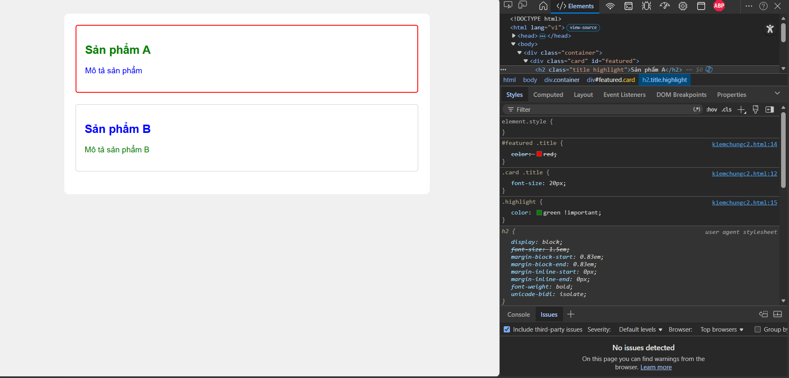
Dòng color: red bị gạch ngang. Mặc dù ID selector (#featured) rất mạnh, nhưng vẫn phải thua trước !important.

Dòng color: green !important. Nằm ở dưới nhưng không bị gạch, nghĩa là giá trị này đang được áp dụng cuối cùng vào phần tử.

User Agent Stylesheet: Ở dưới cùng có thẻ h2 với các thuộc tính như display: block, font-weight: bold. Đây là CSS mặc định của trình duyệt (Chrome). Nếu không viết CSS, trình duyệt sẽ dùng đống này để hiển thị .Font-size: 1.5em bị gạch ngang  vì bị rule .card .title { font-size: 20px } của đè lên .
# Phần B
## Câu B1
# Giải trình các loại CSS Selectors được sử dụng trong bài B1

Yêu cầu đề bài Selector đã dùng trong CSS 
Giải thích
1. Element selector : body, header, footer, tableTarget trực tiếp vào tên thẻ HTML.
2. Class selector.active Target vào thẻ có class="active".
3. ID selector #contact Target vào <aside id="contact">.
4. Descendant selectornav a hoặc header h1 Target thẻ <a> nằm trong thẻ <nav>.
5. Pseudo-class:hover, :nth-child(even)Style cho trạng thái di chuột và dòng kẻ bản

## Câu B2
1. Phần 1
Box Model Lab Answers

- Hộp 1 (content-box): chiều rộng thực tế = 350px 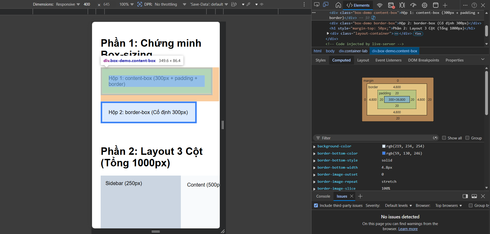
- Hộp 2 (border-box): chiều rộng thực tế = 300px  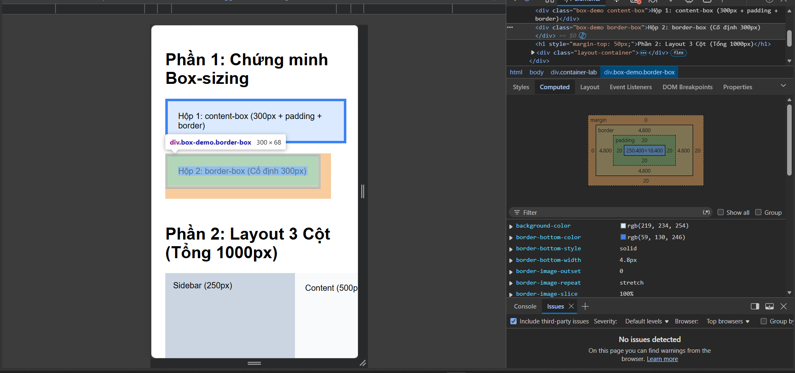

Giải thích: content-box cộng thêm padding và border vào kích thước width, còn border-box bao gồm cả padding và border bên trong kích thước width

2. Phần 2
Minh chứng cho việc border-box đã tự động gói padding vào bên trong để tổng luôn là 250 + 500 + 250 = 1000px.
Ảnh minh họa có border-box cột trái 250px ( đã bao gồm 30px padding trái phải ), cột giữa và cột phải cũng tương tự
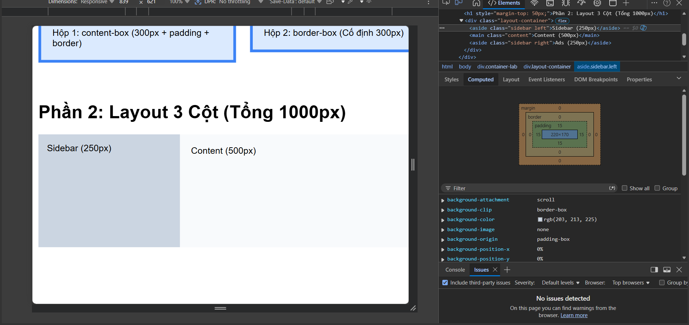
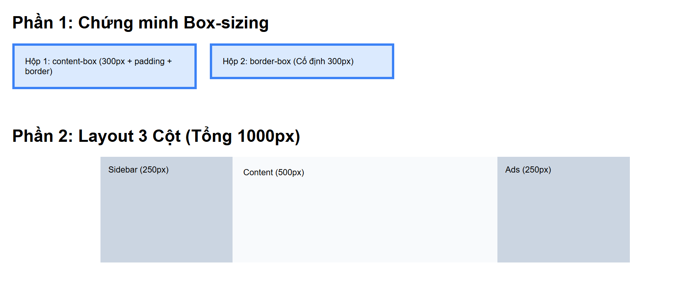
Ảnh minh họa không có border-box cột trái 250px ( chưa bao gồm padding trái phải ), cột giữa và cột phải cũng tương tự
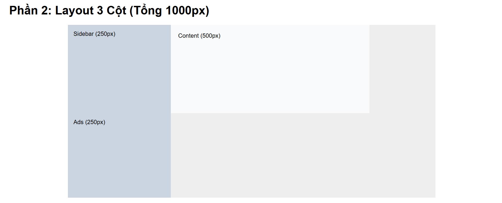
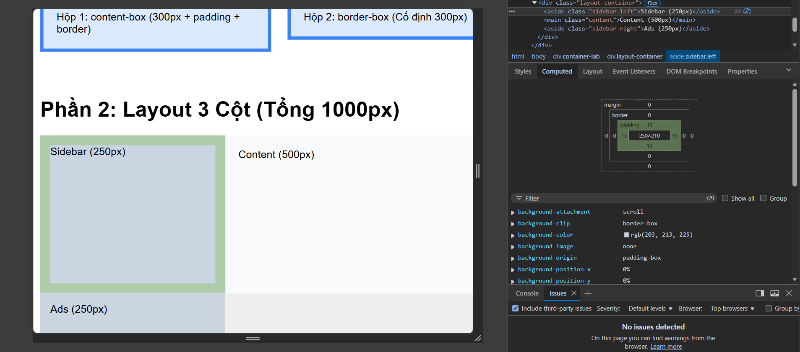

Khi KHÔNG có border-box (chế độ content-box mặc định):

Cột trái: 250px (width) + 15px (padding trái) + 15px (padding phải) = 280px.
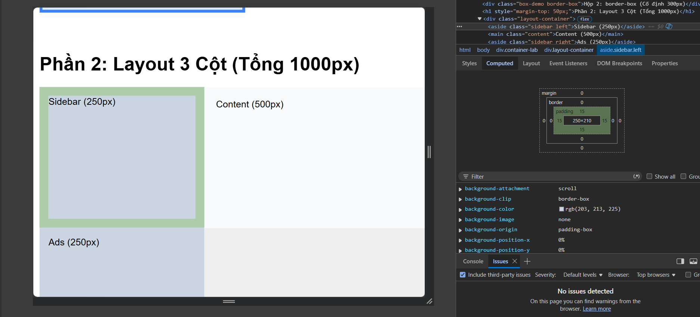
Cột giữa: 500px (width) + 20px (padding trái) + 20px (padding phải) = 540px.
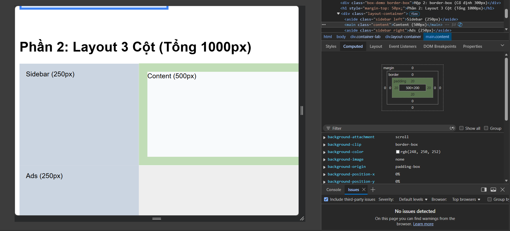
Cột phải: 250px (width) + 15px (padding trái) + 15px (padding phải) = 280px.
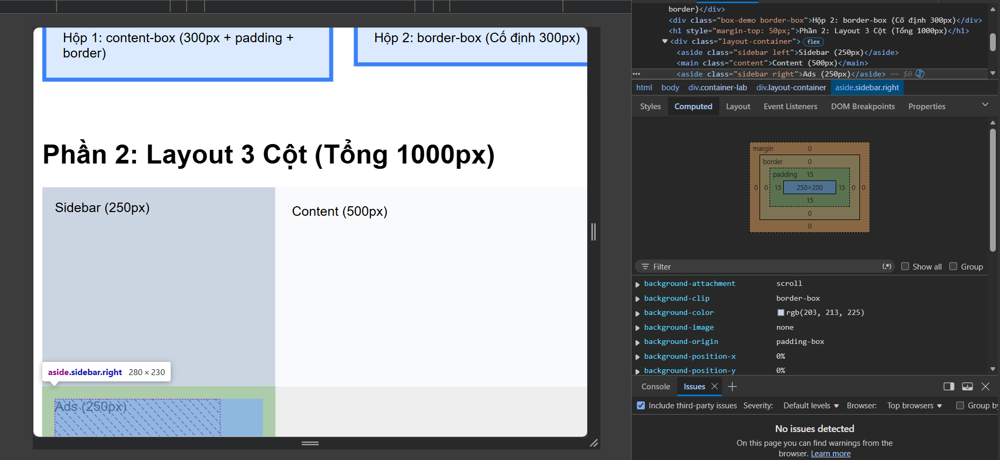

👉 Tổng cộng: 280 + 540 + 280 = 1100px.

## Câu B3
Danh sách 10 Rules & Specificity Score:
* -> (0, 0, 0)

p -> (0, 0, 1)

html body p -> (0, 0, 3)

.text -> (0, 1, 0)

p.text -> (0, 1, 1)

.text.highlight -> (0, 2, 0)

p.text.highlight -> (0, 2, 1)

#demo -> (1, 0, 0)

p#demo -> (1, 0, 1)

p#demo.text.highlight -> (1, 2, 1)

Câu hỏi phân tích:
Element cuối cùng hiển thị màu : Orange (Cam).

Trình duyệt áp dụng quy tắc có điểm Specificity cao nhất. Rule số 10 có điểm (1, 2, 1) vì nó kết hợp cả ID (1), Class (2) và Element (1). Dù rule này nằm ở đầu hay cuối file CSS thì nó vẫn luôn thắng các rule có điểm thấp hơn.

Thay đổi thứ tự rules trong CSS file, kết quả không. Specificity luôn được ưu tiên hàng đầu. Thứ tự viết code (quy tắc Cascade) chỉ có tác dụng khi hai rule có cùng điểm Specificity. Ví dụ, nếu bạn có hai rule cùng là .text { color: green; } và .text { color: blue; }, thì màu nào viết sau sẽ thắng. Nhưng ở đây điểm số khác nhau hoàn toàn nên thứ tự không quan trọng.
Ảnh kết quả: 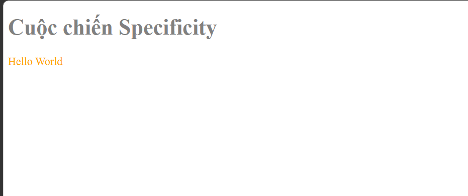