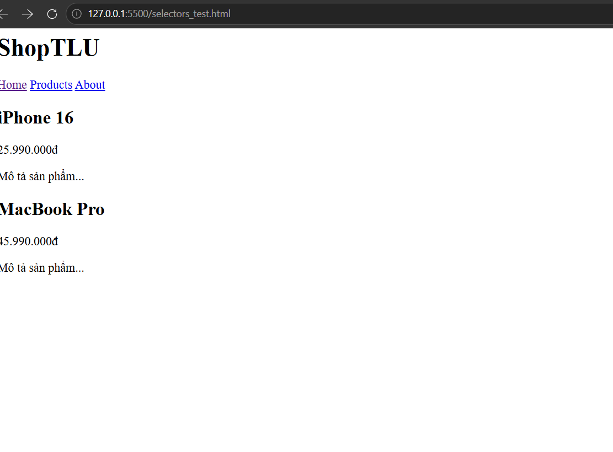

## Câu A1
1. Inline CSS (Nhúng trong attribute style)
Ví dụ chuẩn từ bài học: <h1 style="color: #2563eb; font-size: 32px;">Tiêu đề</h1>

Ưu/Nhược điểm & Bản chất: Không tái sử dụng được, khó maintain. Không thể cache, buộc trình duyệt phải tải lại ở mỗi lượt page load.

Khi nào nên dùng: Chỉ dùng khẩn cấp hoặc cần override (ghi đè) tạm thời.

2. Internal CSS (Nhúng trong thẻ 
</head>
Ưu/Nhược điểm & Bản chất: Chỉ dùng được cho 1 trang riêng biệt, khiến nội dung và giao diện bị dính liền trong 1 file HTML.

Khi nào nên dùng: Chấp nhận dùng khi làm Prototype (bản nháp trực quan) hoặc các trang đơn (Single-page).

3. External CSS (Nhúng file .css riêng biệt)
Ví dụ chuẩn từ bài học:

HTML
<head>
    <link rel="stylesheet" href="styles.css">
</head>
Trong file styles.css: h1 { color: #2563eb; font-size: 32px; }

Ưu điểm vượt trội (Bắt buộc dùng cho Production):

Caching: Trình duyệt cache file CSS sau lần đầu tải, sang trang thứ 2, 3 không cần tải lại nữa -> Tăng tốc độ load.

Tái sử dụng: 50 trang dùng chung 1 file, sửa 1 chỗ là đổi toàn bộ hệ thống website.

Tách biệt cấu trúc (HTML) và giao diện (Presentation) giúp team làm việc song song hiệu quả.

Performance: Có thể nén nhỏ file (Minified CSS như file main.min.css) giúp tối ưu băng thông.

Khi nào nên dùng: Chuẩn Production — Bắt buộc áp dụng cho mọi dự án thực tế.

Đối chiếu câu hỏi phụ (Cái nào thắng?): Tài liệu khẳng định Inline CSS có mức độ ưu tiên cao nhất về mặt Bản chất đặc hiệu (Specificity). Do đó nếu cùng áp dụng vào 1 phần tử, Inline CSS sẽ "thắng" Internal và External. , nhưng nếu chỉ có Internal và External thì thằng nào nằm dưới sẽ thắng do ghi đè thằng ở trên

## Câu A2
Câu A2 — CSS Selectors — Dự đoán kết quả
Dựa vào cấu trúc HTML được cung cấp, các selector sẽ chọn các phần tử cụ thể sau:

1. h1 → Chọn: ShopTLU

2. price → Chọn: 25.990.000đ và 45.990.000đ

3. #app header → Chọn toàn bộ khối header bao gồm các text: ShopTLU, Home, Products, About

4. nav a:first-child → Chọn: Home

5. product.featured h2 → Chọn: MacBook Pro

6. article > p → Chọn các đoạn văn là con trực tiếp của article: 25.990.000đ, Mô tả sản phẩm..., 45.990.000đ, Mô tả sản phẩm...

7. a[href="/"] → Chọn: Home

8. .top-bar.dark h1 → Chọn: ShopTLU
Ảnh kiểm chứng 

