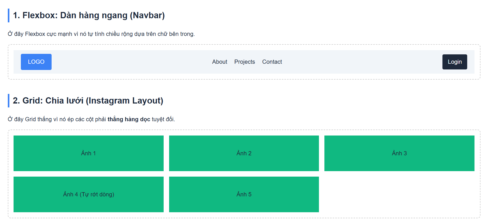
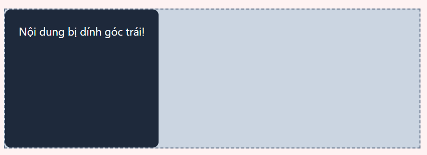
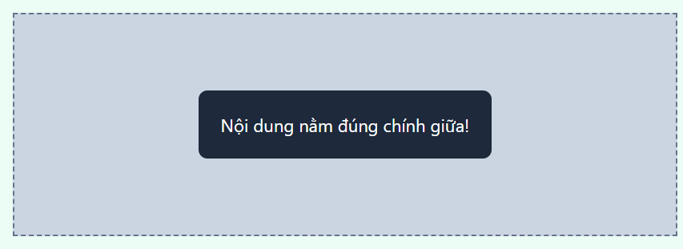
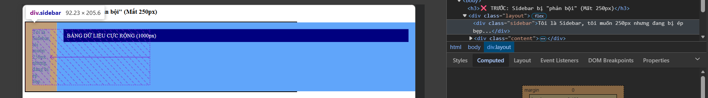
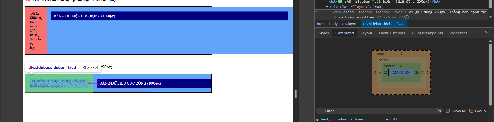
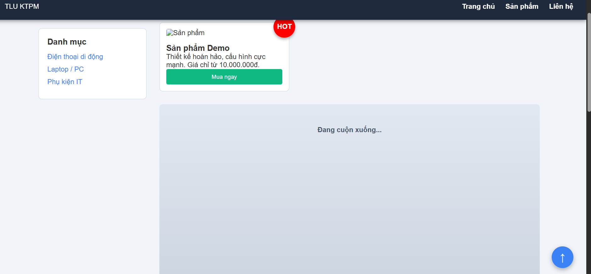

# Phần A
## Câu A1 (10đ) — 5 Loại Positioning
Bảng so sánh 5 thuộc tính Position:
Position , Vẫn chiếm chỗ trong flow? Tham chiếu vị trí (Hệ tọa độ) Cuộn theo trang? Use cases điển hình
1. static: Có ,Luồng tài liệu mặc định (Normal Flow) Có, Mặc định cho mọi phần tử (text; block thông thường).
2. relative: Có, Vị trí ban đầu của chính nó,Có, Dịch chuyển nhẹ phần tử (không ảnh hưởng xung quanh); làm "mỏ neo" cho phần tử con absolute.
3. absolute:  Không (Thoát khỏi flow, các phần tử khác sẽ lấp vào chỗ nó), Nearest positioned ancestor (tổ tiên được position gần nhất), Có (cuộn cùng trang/thẻ cha), Nút close (x) ở góc popup, icon đặt chèn lên ảnh (overlay); tooltip. 

4. fixed: Không, Viewport (Cửa sổ trình duyệt), Không (Đứng im trên màn hình), Sticky Header/Navbar (luôn nổi trên cùng), nút Chat; nút "Cuộn lên đầu trang".
5. sticky: Có, Kết hợp giữa relative (lúc đầu) và fixed (khi cuộn đến ngưỡng cài đặt), Có (nhưng "dính" lại trên màn hình cho đến khi cuộn hết thẻ cha), Tiêu đề các cột trong bảng dữ liệu (Table headers); thanh mục lục (Sidebar) trượt theo nội dung.

Câu hỏi thêm:
1. Khi nào absolute tham chiếu body (hoặc html)?
Khi bạn đặt position: absolute cho một phần tử, nhưng trong toàn bộ cây DOM (từ nó truy ngược lên các thẻ cha, ông nội, cụ nội...), KHÔNG CÓ thẻ tổ tiên nào được thiết lập thuộc tính position (tức là tất cả đều đang mặc định là static). Lúc này, phần tử absolute sẽ lấy chính giới hạn của trang web (thẻ <html> / <body>) làm mốc tọa độ để dịch chuyển (top, right, bottom, left).

2. Khi nào tham chiếu parent (thẻ cha)?
Khi thẻ cha trực tiếp (hoặc thẻ ông nội) của nó được gắn một thuộc tính position bất kỳ khác static (phổ biến nhất là position: relative). Khi đó, gốc tọa độ (0,0) của phần tử absolute sẽ là góc trên cùng bên trái của thẻ cha đó.
Đây là combo kinh điển nhất trong CSS: Cha relative - Con absolute.

3. Khái niệm "nearest positioned ancestor" là gì?
Dịch ra là "Tổ tiên được định vị gần nhất".
Trình duyệt có một cơ chế quét hệ tọa độ: Bắt đầu từ thẻ absolute, nó sẽ dò ngược lên cây DOM. Hễ gặp thẻ cha/ông nào đầu tiên có position là relative, absolute, fixed hoặc sticky, nó sẽ dừng lại ngay lập tức và lấy cái thẻ đó làm "mỏ neo" không gian. Nếu quét đến tận cùng (<body>) mà không thấy ai thỏa mãn, nó neo vào <body>.

## Câu A2
Trường hợp 1

.container { display: flex; }
.item { flex: 1; }
Số lượng: 4 items

Phân tích: Mặc định của display: flex là xếp trên 1 hàng ngang (nowrap). Thuộc tính flex: 1 ép tất cả các item tự động co giãn để chia đều 100% không gian của container.

Bố cục dự đoán: 1 hàng ngang, 4 cột. Cả 4 items có chiều rộng bằng nhau y hệt.

Sơ đồ (Text Art):

Plaintext
+-------------------------------------------------------+
| +----------+  +----------+  +----------+  +----------+|
| |  Item 1  |  |  Item 2  |  |  Item 3  |  |  Item 4  ||
| +----------+  +----------+  +----------+  +----------+|
+-------------------------------------------------------+

Trường hợp 2

.container { display: flex; flex-wrap: wrap; }
.item { width: 45%; margin: 2.5%; }
Số lượng: 6 items

Phân tích: flex-wrap: wrap cho phép các item tự động rớt xuống dòng khi hết chỗ. Mỗi item chiếm không gian ngang là 2.5% (margin trái) + 45% (width) + 2.5% (margin phải) = 50%. Tức là cứ 2 item sẽ vừa khít 100% của một hàng.

Bố cục dự đoán: 3 hàng, 2 cột. Các item chia thành lưới 2 cột đều nhau.

Sơ đồ (Text Art):

Plaintext
+-------------------------------------------------------+
|    +--------------------+    +--------------------+   |
|    | Item 1 (45%)       |    | Item 2 (45%)       |   |
|    +--------------------+    +--------------------+   |
|    +--------------------+    +--------------------+   |
|    | Item 3 (45%)       |    | Item 4 (45%)       |   |
|    +--------------------+    +--------------------+   |
|    +--------------------+    +--------------------+   |
|    | Item 5 (45%)       |    | Item 6 (45%)       |   |
|    +--------------------+    +--------------------+   |
+-------------------------------------------------------+
Trường hợp 3

.container { display: flex; justify-content: space-between; align-items: center; }
Số lượng: 3 items

Phân tích: justify-content: space-between đẩy item đầu tiên sát lề trái, item cuối cùng sát lề phải, và item giữa nằm ở chính giữa tâm. align-items: center giúp chúng căn đều nhau theo chiều dọc của container. Đây là layout kinh điển cho Header (Logo - Menu - Nút Login).

Bố cục dự đoán: 1 hàng, 3 items nằm trải dài từ trái sang phải, cách đều nhau, căn giữa theo chiều dọc.

Sơ đồ (Text Art):

Plaintext
+-------------------------------------------------------+
|                                                       |
|  +--------+               +--------+               +--------+  
|  | Item 1 |               | Item 2 |               | Item 3 |  
|  +--------+               +--------+               +--------+  
|                                                       |
+-------------------------------------------------------+
Trường hợp 4 

.container { display: grid; grid-template-columns: 200px 1fr 200px; gap: 20px; }
Số lượng: 3 items

Phân tích: Đây là Grid layout chia thành 3 cột rõ ràng. Cột trái cố định 200px, cột phải cố định 200px. Cột giữa dùng đơn vị 1fr (fraction) sẽ "ăn" trọn phần không gian còn dư lại ở giữa. Có khoảng trống (gap) 20px giữa các cột.

Bố cục dự đoán: 1 hàng, 3 cột. Đây là layout "Holy Grail" nằm ngang cơ bản (Sidebar trái - Nội dung chính - Sidebar phải).

Sơ đồ (Text Art):

Plaintext
+-------------------------------------------------------+
| +--------+    +--------------------------+    +--------+ |
| | 200px  |    |           1fr            |    | 200px  | |
| | Item 1 |    |         Item 2           |    | Item 3 | |
| +--------+    +--------------------------+    +--------+ |
+-------------------------------------------------------+
Trường hợp 5

.container { display: grid; grid-template-columns: repeat(3, 1fr); gap: 10px; }
Số lượng: 7 items

Phân tích: Khai báo một lưới với chính xác 3 cột bằng nhau (repeat(3, 1fr)). Khi có 7 items, Grid sẽ tự động đổ dữ liệu từ trái sang phải, cứ đủ 3 item là ngắt xuống dòng. Phép tính: 7 chia 3 được 2 dư 1.

Bố cục dự đoán: 3 hàng, 3 cột. Hàng 1 và 2 đầy đủ. Hàng 3 chỉ có 1 item (Item 7) nằm ở góc dưới cùng bên trái, chừa lại 2 ô trống bên cạnh.

Sơ đồ (Text Art):

Plaintext
+-------------------------------------------------------+
|  +---------+   +---------+   +---------+              |
|  | Item 1  |   | Item 2  |   | Item 3  |              |
|  +---------+   +---------+   +---------+              |
|  +---------+   +---------+   +---------+              |
|  | Item 4  |   | Item 5  |   | Item 6  |              |
|  +---------+   +---------+   +---------+              |
|  +---------+                                          |
|  | Item 7  |      (Trống)       (Trống)               |
|  +---------+                                          |
+-------------------------------------------------------+

# Phần C
## Câu C1
Flexbox = Layout 1 chiều (1D - Hàng HOẶC Cột) | Grid = Layout 2 chiều (2D - Hàng VÀ Cột).

1. Navigation bar ngang (logo + menu + buttons)

Chọn: Flexbox

Giải thích: Header là một cấu trúc 1 chiều (hàng ngang). Flexbox giải quyết cực kỳ gọn gàng việc đẩy Logo sang trái, Nút sang phải (dùng justify-content: space-between) và căn giữa các phần tử theo chiều dọc (align-items: center).

2. Lưới ảnh Instagram (3 cột đều nhau, số ảnh không biết trước)

Chọn: Grid

Giải thích: Đây là cấu trúc 2 chiều (vừa có cột, vừa sinh ra hàng mới). Grid sinh ra để làm việc này với dòng code grid-template-columns: repeat(3, 1fr). Nó sẽ tự động dàn 3 cột đều tăm tắp mà không cần tính toán margin phức tạp như Flexbox.

3. Layout blog: main content + sidebar

Chọn: Grid (Khuyên dùng)

Giải thích: Bố cục vĩ mô (Macro-layout) của trang thường dùng Grid. Chỉ cần grid-template-columns: 1fr 300px là xong. Nếu dùng Flexbox, bạn rất dễ dính lỗi Sidebar bị co lại (như Lỗi 3 ở bài C2 bên dưới).

4. Footer với 4 cột thông tin (Về chúng tôi, Liên kết, Hỗ trợ, Liên hệ)

Chọn: Grid

Giải thích: Tương tự như lưới ảnh, bạn muốn chia 4 cột bằng nhau hoàn hảo. Dùng grid-template-columns: repeat(4, 1fr) là chuẩn nhất. Khi xuống Mobile, chỉ cần đổi thành repeat(1, 1fr) là thành 1 cột dọc chồng lên nhau.

5. Card sản phẩm (ảnh trên, text giữa, nút dưới — nút luôn dính đáy)

Chọn: Flexbox

Giải thích: Nội dung bên trong 1 cái Card chảy theo 1 chiều dọc (Hàng dọc). Cài đặt Card thành display: flex; flex-direction: column; và cho Nút bấm thuộc tính margin-top: auto; — Nút sẽ luôn bị đẩy dính chặt xuống đáy bất kể đoạn text ở giữa dài hay ngắn.

## Câu C2
Lỗi 1: Cards không đều chiều cao — nút "Mua" nhảy lộn xộn
Nguyên nhân: Các card trong Flex container (khi align-items: stretch mặc định) đã có chiều cao bằng nhau. NHƯNG, nội dung bên trong (h3, p) độ dài khác nhau, khiến phần tử cuối cùng (nút Mua) nằm lơ lửng không thẳng hàng ngang với các thẻ khác.

Code sửa: 
CSS
.card {
    width: 30%;
    margin: 1.5%;
    display: flex;           
}
.card .btn {
    padding: 10px;
    margin-top: auto;        
}

Lỗi 2: Muốn items nằm giữa cả ngang lẫn dọc trong container 100vh
Nguyên nhân: Khai báo display: flex; chỉ mới kích hoạt môi trường Flexbox. Mặc định nó sẽ bám chặt vào góc trên bên trái (flex-start). Thiếu lệnh căn trục chính và trục chéo.

Code sửa:

CSS
.hero {
    height: 100vh;
    display: flex;
    justify-content: center; 
}
.hero-content {
    text-align: center;
}

Lỗi 3: Sidebar bị co lại khi content quá dài
Nguyên nhân: Flexbox có một thuộc tính ngầm định là flex-shrink: 1. Nghĩa là khi không gian bị chật (do content quá lớn đẩy ra), các phần tử khác sẽ bị "bóp" lại để nhường chỗ. Mặc dù bạn set width: 250px, Flexbox vẫn lờ đi và ép nó nhỏ lại.

Code sửa: Cấm Sidebar co lại.

CSS
.layout { display: flex; }
.sidebar {
    width: 250px;
    flex-shrink: 0;
}
.content { flex: 1; }
 
 (290px bao gồm cả padding trái phải )

# Phần B
## Câu B1
