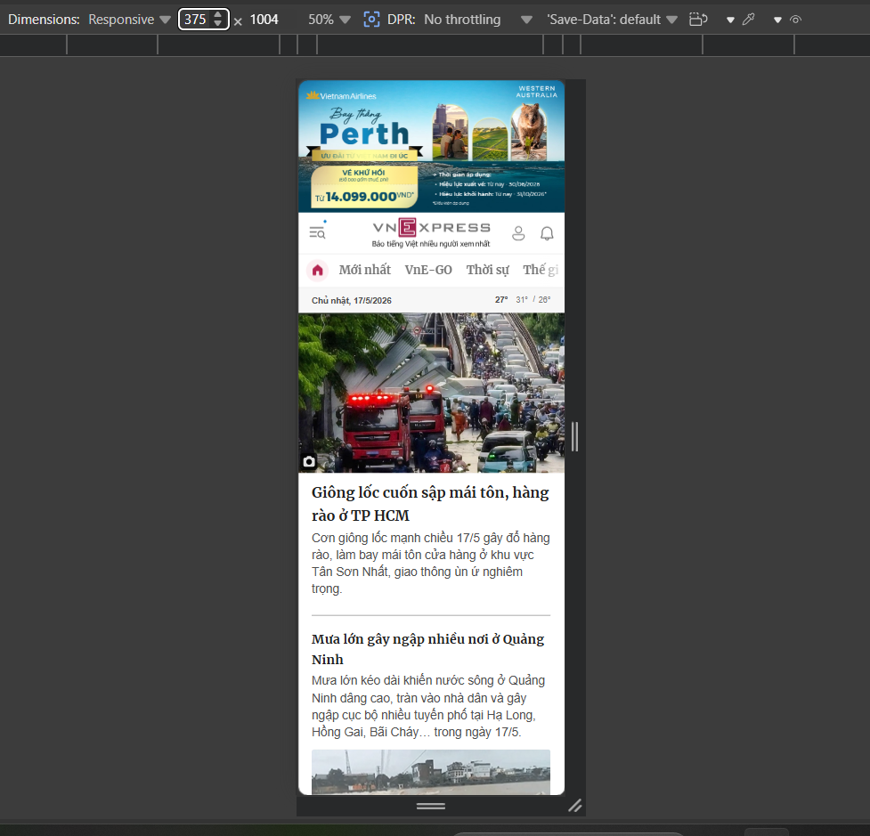
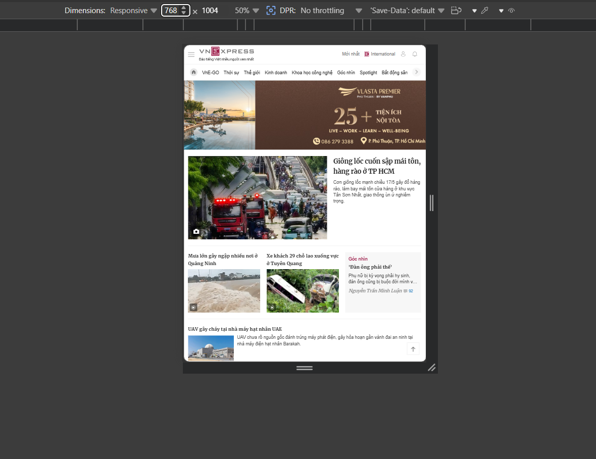
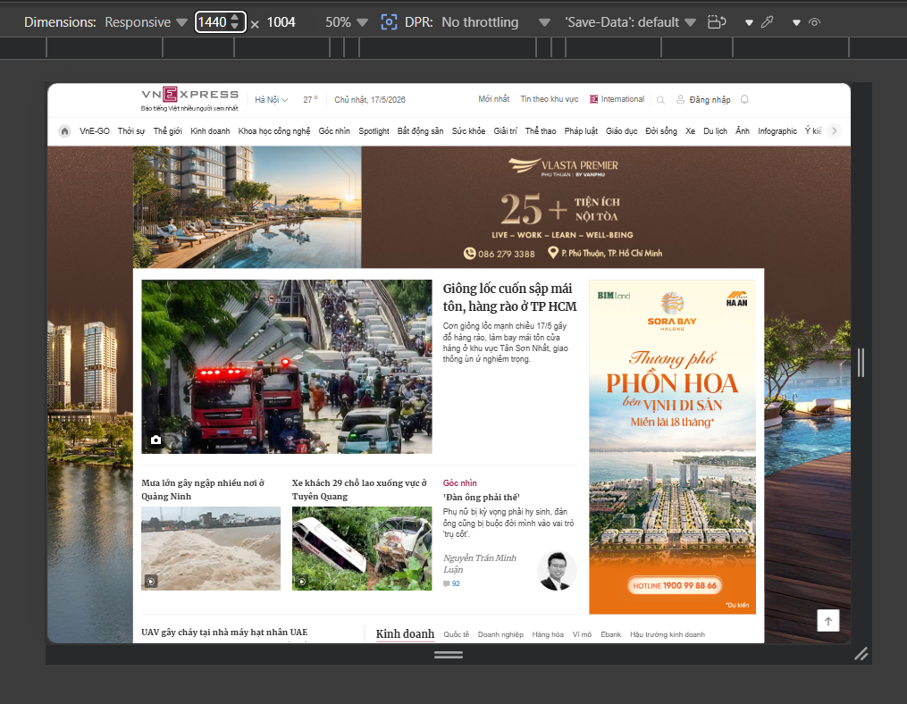
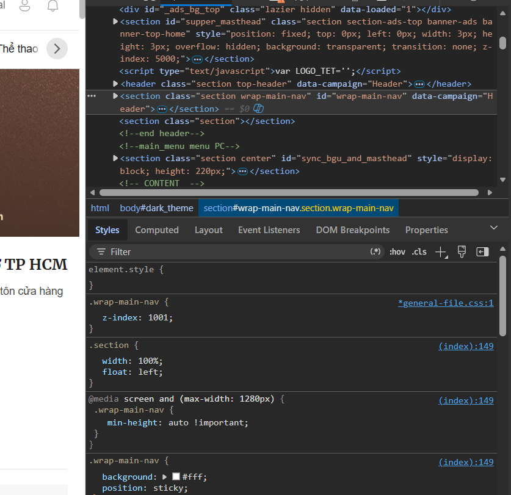
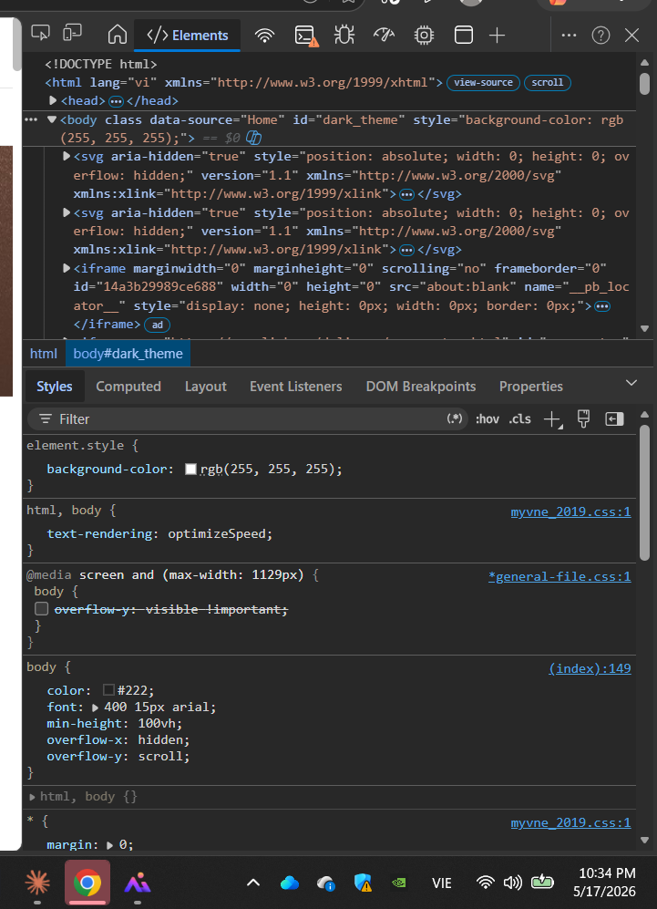
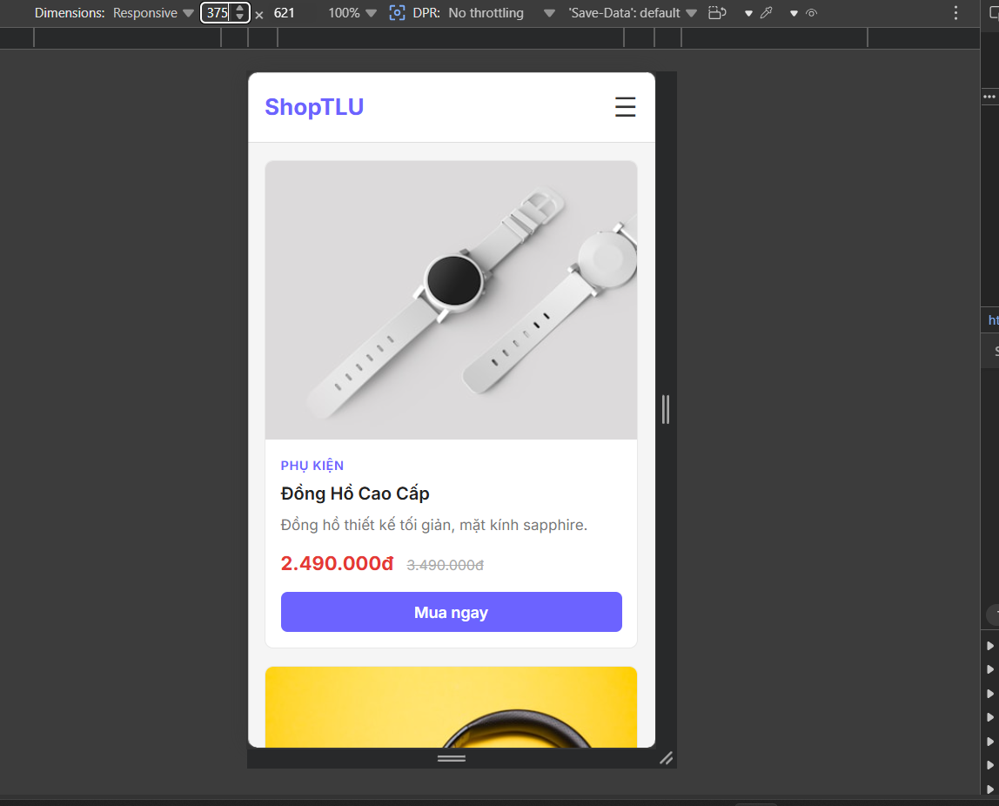
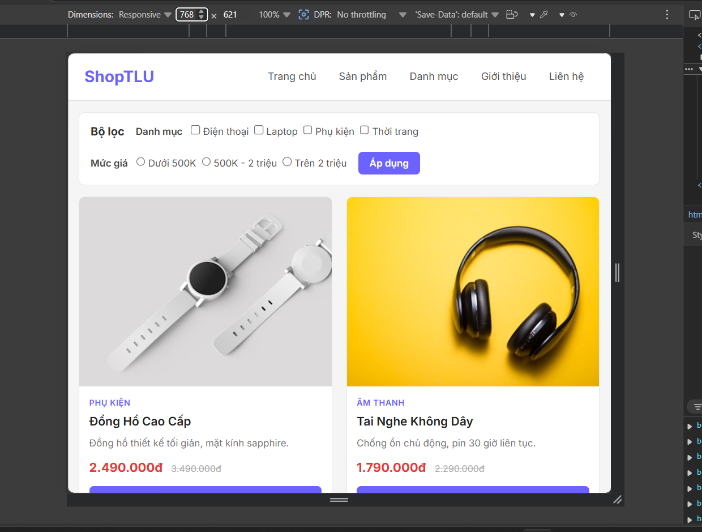
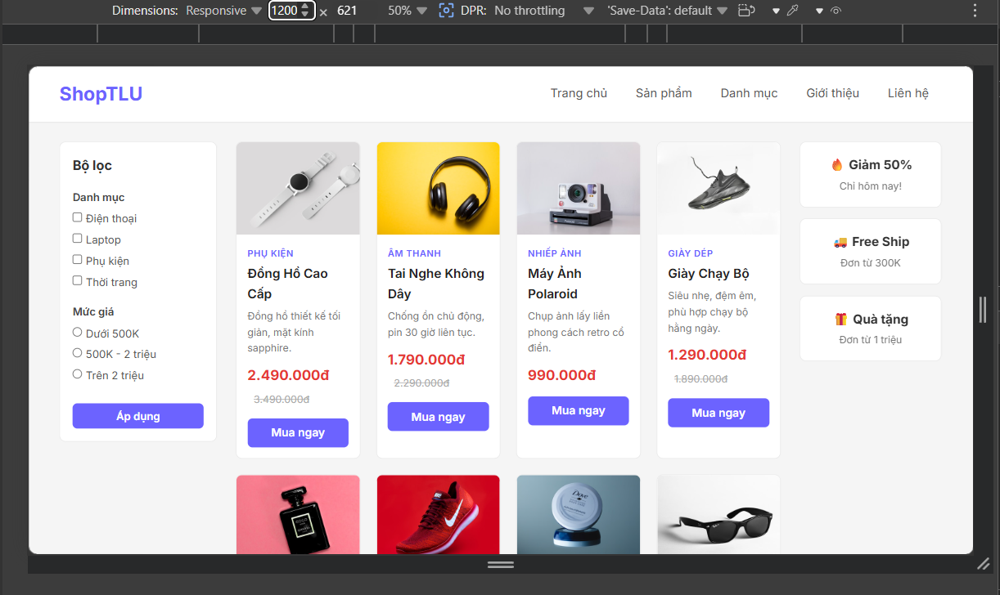

# PHẦN A 

## Câu A1 

### 1. Thẻ `<meta viewport>` chuẩn

```html
<meta name="viewport" content="width=device-width, initial-scale=1.0">
```

**Giải thích từng thuộc tính:**

| Thuộc tính | Giá trị | Ý nghĩa |
|---|---|---|
| `name="viewport"` | — | Xác định đây là thẻ điều khiển vùng hiển thị (viewport) |
| `width=device-width` | độ rộng thiết bị | Đặt chiều rộng viewport bằng đúng chiều rộng màn hình vật lý của thiết bị, thay vì dùng giá trị mặc định 980px |
| `initial-scale=1.0` | 1.0 (100%) | Mức zoom ban đầu khi trang tải = 100%, không phóng to/thu nhỏ |

---

### 2. Nếu THIẾU thẻ `<meta viewport>`, iPhone hiển thị như thế nào?

Khi thiếu thẻ `<meta viewport>`, trình duyệt di động (Safari trên iPhone) sẽ:

- **Giả lập viewport 980px** (mặc định) — tức là coi trang có chiều rộng 980px dù màn hình chỉ 375px.
- **Thu nhỏ (zoom out) toàn bộ trang** để vừa màn hình → chữ và nút cực kỳ nhỏ, không đọc được.
- Người dùng phải **pinch-to-zoom** để đọc nội dung → trải nghiệm rất tệ.
- Tất cả media queries dựa trên `device-width` sẽ **không hoạt động đúng**.
(đối chiếu với  chương 13 Thiếu dòng này: iPhone giả định trang rộng 980px (như desktop) → thu nhỏ lại → chữ bé xíu → UX tệ.)

### 3. Mobile-First vs Desktop-First

**Mobile-First:** Viết CSS mặc định cho màn hình nhỏ trước, sau đó dùng `@media (min-width: ...)` để mở rộng lên màn hình lớn hơn.

**Desktop-First:** Viết CSS mặc định cho màn hình lớn trước, sau đó dùng `@media (max-width: ...)` để thu nhỏ cho màn hình nhỏ hơn.

Ví dụ CSS — breakpoint 768px

**Mobile-First (`min-width`):**
```css
/* Mặc định: mobile (< 768px) */
.container {
    width: 100%;
    padding: 10px;
    font-size: 14px;
}

/* Tablet trở lên (≥ 768px) */
@media (min-width: 768px) {
    .container {
        width: 720px;
        margin: 0 auto;
        font-size: 16px;
    }
}
```

**Desktop-First (`max-width`):**
```css
/* Mặc định: desktop (≥ 768px) */
.container {
    width: 720px;
    margin: 0 auto;
    font-size: 16px;
}

/* Mobile (< 768px) */
@media (max-width: 767px) {
    .container {
        width: 100%;
        padding: 10px;
        font-size: 14px;
    }
}
```

#### Tại sao Mobile-First được khuyên dùng?

1. Ưu tiên đúng thực tế: Hơn 60% lưu lượng web đến từ thiết bị di động — thiết kế cho đối tượng đa số trước.
2. Hiệu năng tốt hơn: Trình duyệt mobile tải CSS tối thiểu cần thiết; không tải rồi ghi đè như Desktop-First.
3. Tư duy "progressive enhancement": Bắt đầu từ nền tảng tối giản, thêm tính năng dần cho màn hình lớn hơn.
4. Tránh lỗi layout: Dễ kiểm soát hơn khi mở rộng lên thay vì thu nhỏ xuống.
5. Đượcc Google ưu tiên: Google sử dụng Mobile-First Indexing → ảnh hưởng SEO.

---

## Câu A2 

### Breakpoints chuẩn (theo Bootstrap 5)

| Tên | Kích thước (px) | Thiết bị đại diện | Lưới sản phẩm |
|---|---|---|---|
| xs (Extra small) | `< 576px` | Điện thoại cũ, iPhone SE | 1 cột |
| sm (Small) | `≥ 576px` | Điện thoại lớn (iPhone Plus, Galaxy) | 1–2 cột |
| md (Medium) | `≥ 768px` | Tablet (iPad, Samsung Tab) | 2 cột |
| lg (Large) | `≥ 992px` | Laptop 13–15 inch | 3 cột |
| xl (Extra large) | `≥ 1200px` | Desktop, Màn hình lớn | 4 cột |
| xxl (Extra extra large) | `≥ 1400px` | Màn hình 4K, Ultrawide | 4–6 cột |

---

## Câu A3

### Đọc CSS và điền vào bảng.

```css
.container { width: 100%; padding: 10px; }

@media (min-width: 576px)  { .container { width: 540px;  } }
@media (min-width: 768px)  { .container { width: 720px;  } }
@media (min-width: 992px)  { .container { width: 960px;  } }
@media (min-width: 1200px) { .container { width: 1140px; } }
```

**Quy tắc:** CSS đọc từ trên xuống, rule cuối cùng thỏa điều kiện sẽ được áp dụng (cascade). Với `min-width`, màn hình đạt **ít nhất** ngưỡng đó mới kích hoạt.

| Chiều rộng màn hình | `.container` width | Giải thích |
|---|---|---|
| **375px** (iPhone SE) | `100%` (= 375px) | Không đạt bất kỳ breakpoint nào (< 576px) → dùng style mặc định `width: 100%` |
| **600px** | `540px` | Đạt `min-width: 576px` → `width: 540px`; chưa đạt 768px |
| **800px** | `720px` | Đạt `min-width: 768px` → `width: 720px`; chưa đạt 992px |
| **1000px** | `960px` | Đạt `min-width: 992px` → `width: 960px`; chưa đạt 1200px |
| **1400px** | `1140px` | Đạt `min-width: 1200px` → `width: 1140px` (rule cuối cùng và cao nhất) |

---

## Câu A4 

### 4 tính năng chính của SCSS

---

 1. Variables (Biến — `$`)

Lưu trữ các giá trị tái sử dụng (màu sắc, font, kích thước…) vào biến có tên, tránh lặp lại "magic values" khắp file CSS.

```scss
// Khai báo biến
$primary-color: #6366f1;
$font-size-base: 16px;
$border-radius: 8px;

// Sử dụng biến
.button {
    background-color: $primary-color;
    font-size: $font-size-base;
    border-radius: $border-radius;
}

.link {
    color: $primary-color; // Dùng lại cùng giá trị
}
```

**Lợi ích:** Thay đổi màu chủ đạo chỉ cần sửa 1 chỗ → cập nhật toàn bộ file.

 2. Nesting (Lồng nhau)

Viết CSS lồng bên trong selector cha, phản ánh cấu trúc HTML và giúp code dễ đọc hơn.

```scss
// SCSS
.navbar {
    background: #1e293b;
    padding: 16px;

    .nav-link {               // Compile → .navbar .nav-link
        color: #94a3b8;
        font-size: 14px;

        &:hover {             // Compile → .navbar .nav-link:hover
            color: #fff;
        }

        &.active {            // Compile → .navbar .nav-link.active
            color: #6366f1;
            font-weight: bold;
        }
    }

    .nav-logo {               // Compile → .navbar .nav-logo
        font-size: 1.5rem;
        font-weight: 700;
    }
}
```

**Lưu ý:** Không nên lồng quá 3 cấp (tránh tạo ra selector quá dài, khó override).

---

 3. Mixins (`@mixin` / `@include`)

Định nghĩa một "hàm CSS" tái sử dụng được, có thể nhận tham số.

```scss
// Khai báo mixin
@mixin flex-center($direction: row) {
    display: flex;
    justify-content: center;
    align-items: center;
    flex-direction: $direction;
}

@mixin button-style($bg, $color: #fff) {
    background-color: $bg;
    color: $color;
    padding: 10px 20px;
    border: none;
    border-radius: 8px;
    cursor: pointer;
    transition: opacity 0.2s;

    &:hover { opacity: 0.85; }
}

// Sử dụng mixin
.hero {
    @include flex-center(column);  // Truyền tham số
    height: 400px;
}

.btn-primary {
    @include button-style(#6366f1);
}

.btn-danger {
    @include button-style(#ef4444);
}
```

---

 4. `@extend` / Kế thừa

Cho phép một selector **kế thừa toàn bộ style** của selector khác, tránh lặp code.

```scss
// Định nghĩa "lớp gốc" (placeholder %)
%card-base {
    background: white;
    border: 1px solid #e2e8f0;
    border-radius: 12px;
    padding: 20px;
    box-shadow: 0 2px 8px rgba(0,0,0,0.1);
}

// Kế thừa
.product-card {
    @extend %card-base;
    /* Thêm style riêng */
    max-width: 280px;
}

.blog-card {
    @extend %card-base;
    /* Thêm style riêng */
    max-width: 400px;
    border-top: 4px solid #6366f1;
}
```

**So sánh `@mixin` vs `@extend`:**
- `@mixin`: Copy-paste style vào từng selector (file CSS lớn hơn, linh hoạt hơn).
- `@extend`: Gộp các selector lại thành 1 rule (file CSS nhỏ hơn, nhưng ít linh hoạt hơn).

---

### Tại sao trình duyệt KHÔNG đọc được file `.scss`?

**Lý do:** Trình duyệt chỉ hiểu **CSS thuần** (W3C standard). File `.scss` chứa cú pháp mở rộng như biến `$`, nesting, `@mixin`… không thuộc đặc tả CSS gốc.

**Các bước chuyển SCSS → CSS:**

```
File .scss  →  [Sass Compiler]  →  File .css  →  Trình duyệt
```

**Cách thực hiện (chọn 1 trong các cách):**

1. **Sass CLI (Node.js):**
   ```bash
   npm install -g sass
   sass style.scss style.css          # Biên dịch 1 lần
   sass --watch style.scss style.css  # Tự động biên dịch khi lưu
   ```

2. **Extension VS Code:** Cài **"Live Sass Compiler"** → nhấn "Watch Sass" ở thanh dưới.

3. **Build tools:** Webpack, Vite, Parcel đều có plugin xử lý SCSS tự động.

---

# PHẦN C — PHÂN TÍCH

## Câu C1 (10đ) — Phân tích trang VNExpress.net

Trang phân tích: **https://vnexpress.net**

### Screenshots 3 kích thước





---

### 1. Navigation thay đổi thế nào?

| Kích thước | Mô tả Navigation |
|---|---|
| **Mobile (375px)** | Thanh nav thu gọn lại, các mục chuyên mục chính bị ẩn. Xuất hiện icon **hamburger** ở góc trái để mở menu dạng sidebar trượt từ bên trái ra. Logo VNExpress nằm giữa, icon tìm kiếm ở bên phải. |
| **Tablet (768px)** | Thanh nav hiện một phần các mục chuyên mục (Thời sự, Góc nhìn, Thế giới...) dạng **cuộn ngang** (scroll horizontal). Không còn hamburger, nhưng một số mục phụ bị ẩn. |
| **Desktop (1440px)** | Thanh nav hiển thị đầy đủ tất cả chuyên mục trên **1 hàng ngang**. Có thêm thanh nav phụ phía trên với ngày tháng, đăng nhập, và các liên kết phụ. |

### 2. Lưới content thay đổi mấy cột?

| Kích thước | Số cột | Chi tiết |
|---|---|---|
| **Mobile (375px)** | **1 cột** | Tất cả bài viết xếp dọc, ảnh chiếm full width |
| **Tablet (768px)** | **2 cột** | Bài chính chiếm khoảng 60%, bài phụ 40%. Một số section vẫn 1 cột |
| **Desktop (1440px)** | **3 cột** | Bài chính giữa (lớn nhất), sidebar trái có danh mục, sidebar phải có quảng cáo + tin nổi bật |

### 3. Elements nào bị ẩn trên mobile?

- **Sidebar phải** (quảng cáo, tin nổi bật) → hoàn toàn bị ẩn
- **Thanh nav phụ** phía trên (ngày tháng, đăng nhập) → ẩn
- **Một số banner quảng cáo lớn** → ẩn hoặc thu nhỏ
- **Phần bình luận nổi bật** → ẩn trên mobile
- **Footer chi tiết** → thu gọn lại, chỉ hiện các link chính

### 4. Font size có thay đổi không?

**Có thay đổi.**

| Thành phần | Mobile | Tablet | Desktop |
|---|---|---|---|
| Tiêu đề bài chính | ~18px | ~22px | ~24px |
| Tiêu đề bài phụ | ~15px | ~16px | ~18px |
| Mô tả ngắn | ~14px | ~14px | ~15px |
| Body text | ~15px | ~16px | ~17px |

Font size tăng dần theo kích thước màn hình để đảm bảo khả năng đọc phù hợp.

### 5. Media queries trang VNExpress sử dụng
Các media queries VNExpress dùng (tìm trong DevTools → Styles):




**Nhận xét:** VNExpress sử dụng phương pháp **Desktop-First** (dùng `max-width`) — ngược với Mobile-First. Đây là cách tiếp cận phổ biến ở các trang tin tức lớn vì nội dung chính được thiết kế cho desktop trước.

---

## Câu C2 (10đ) — Thiết kế Responsive Strategy

Thiết kế trang **Đặt bàn nhà hàng** responsive.

### Wireframe — Mobile (< 768px)

```
┌──────────────────────┐
│ HEADER               │
│ [Logo]  [☎ Gọi ngay] │
├──────────────────────┤
│ HERO IMAGE           │
│ (ảnh full width)     │
├──────────────────────┤
│ GRID ẢNH MÓN ĂN     │
│ (2 cột)              │
│ [img1] [img2]        │
│ [img3] [img4]        │
│ [img5] [img6]        │
├──────────────────────┤
│ FORM ĐẶT BÀN        │
│ (full width, xếp dọc)│
│ [Ngày      ]         │
│ [Giờ       ]         │
│ [Số người  ]         │
│ [Ghi chú   ]         │
│ [Đặt bàn]            │
├──────────────────────┤
│ GOOGLE MAPS          │
│ (full width)         │
├──────────────────────┤
│ FOOTER               │
└──────────────────────┘
```

**Mobile:** Số điện thoại thu gọn thành icon ☎. Hero image full width. Grid ảnh 2 cột. Form xếp dọc full width. Bản đồ nằm dưới form.

### Wireframe — Tablet (768px - 1023px)

```
┌─────────────────────────────────┐
│ HEADER                           │
│ [Logo]   [Menu ngang]   [☎ SĐT] │
├─────────────────────────────────┤
│ HERO IMAGE (full width)          │
├─────────────────────────────────┤
│ GRID ẢNH MÓN ĂN (3 cột)        │
│ [img1]  [img2]  [img3]          │
│ [img4]  [img5]  [img6]          │
├────────────────┬────────────────┤
│ FORM ĐẶT BÀN  │  GOOGLE MAPS   │
│ (50%)          │  (50%)         │
├────────────────┴────────────────┤
│ FOOTER                           │
└─────────────────────────────────┘
```

**Tablet:** Grid ảnh 3 cột. Form và bản đồ nằm **cạnh nhau** (2 cột 50/50).

### Wireframe — Desktop (≥ 1024px)

```
┌───────────────────────────────────────────────┐
│ HEADER                                         │
│ [Logo]     [Menu ngang đầy đủ]     [☎ 0123...] │
├───────────────────────────────────────────────┤
│ HERO IMAGE (full width, cao hơn)               │
├───────────────────────────────────────────────┤
│ GRID ẢNH MÓN ĂN (3 cột, ảnh lớn hơn)         │
│ [img1]     [img2]     [img3]                   │
│ [img4]     [img5]     [img6]                   │
├──────────────────────────┬────────────────────┤
│ FORM ĐẶT BÀN            │  GOOGLE MAPS       │
│ (40%)                    │  (60%)             │
│ Ngày: [____] Giờ: [____] │                    │
│ Số người: [__]           │                    │
│ Ghi chú: [____________]  │                    │
│ [    Đặt bàn    ]        │                    │
├──────────────────────────┴────────────────────┤
│ FOOTER                                         │
└───────────────────────────────────────────────┘
```

**Desktop:** Layout không có sidebar riêng. Grid ảnh 3 cột với kích thước lớn hơn. Form + bản đồ chia 2 cột (40/60). Header hiện đầy đủ số điện thoại.

### Trả lời câu hỏi

**Mobile — Những gì bị ẩn? Form nằm đâu?**
- Số điện thoại đầy đủ bị ẩn → chỉ hiện icon ☎ (bấm vào gọi luôn)
- Menu nav ẩn → dùng hamburger
- Form nằm **dưới grid ảnh**, xếp dọc full width

**Tablet — Grid ảnh mấy cột? Bản đồ nằm đâu?**
- Grid ảnh **3 cột**
- Bản đồ nằm **cạnh form** (chia 2 cột 50/50)

**Desktop — Layout bao nhiêu cột? Sidebar có không?**
- Layout chính **1 cột** (full width), phần form + map chia **2 cột** (40/60)
- **Không có sidebar** riêng biệt — trang đặt bàn đơn giản, không cần sidebar

### CSS Skeleton (Mobile-First)

```css
/* === Mobile mặc định === */
* { margin: 0; padding: 0; box-sizing: border-box; }

.header {
    display: flex;
    justify-content: space-between;
    align-items: center;
    padding: 12px 16px;
}

.nav-menu { display: none; }

.hero img {
    width: 100%;
    height: auto;
}

.food-grid {
    display: grid;
    grid-template-columns: repeat(2, 1fr);
    gap: 10px;
    padding: 16px;
}

.booking-section {
    padding: 16px;
}

.booking-form { margin-bottom: 20px; }

.map-container {
    width: 100%;
    height: 300px;
}

.footer {
    padding: 20px 16px;
    text-align: center;
}

/* === Tablet (≥ 768px) === */
@media (min-width: 768px) {
    .nav-menu {
        display: flex;
        gap: 10px;
    }

    .food-grid {
        grid-template-columns: repeat(3, 1fr);
        gap: 16px;
    }

    .booking-section {
        display: grid;
        grid-template-columns: 1fr 1fr;
        gap: 20px;
    }
}

/* === Desktop (≥ 1024px) === */
@media (min-width: 1024px) {
    .header { padding: 16px 40px; }

    .food-grid {
        gap: 20px;
        padding: 24px 40px;
    }

    .booking-section {
        grid-template-columns: 2fr 3fr;
        padding: 24px 40px;
    }

    .map-container { height: 400px; }
}
```

---


# Phần B
## Bài B1




## Bài B3 — Lệnh compile SCSS

```bash
# Cài Sass
npm install -g sass

# Compile SCSS thành CSS
sass scss/style.scss style.css

# Tự động compile khi lưu file
sass --watch scss/style.scss:style.css
```

