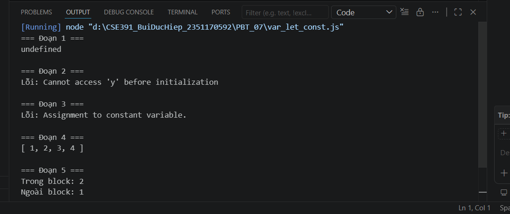
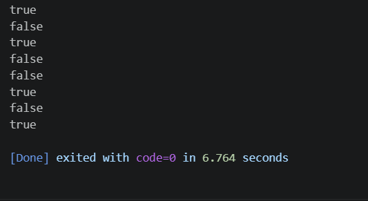
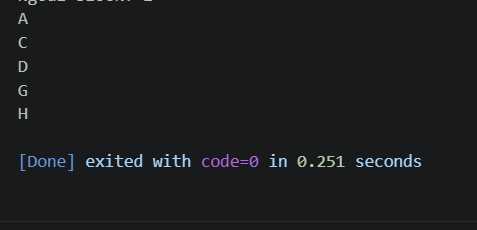

# PBT_07 — JavaScript Cơ Bản

## Câu A1 (5đ) — var / let / const

### Dự đoán output

**Đoạn 1:**
```js
console.log(x);
var x = 5;
```
**Dự đoán:** `undefined`
**Giải thích:** `var` bị hoisting — khai báo được đưa lên đầu nhưng giá trị chưa gán. Tương đương:
```js
var x;          // hoisting: khai báo lên đầu
console.log(x); // undefined (chưa gán giá trị)
x = 5;
```

---

**Đoạn 2:**
```js
console.log(y);
let y = 10;
```
**Dự đoán:**  **ReferenceError: Cannot access 'y' before initialization**
**Giải thích:** `let` cũng bị hoisting nhưng nằm trong "Temporal Dead Zone" (TDZ) — không thể truy cập trước khi khai báo. Khác với `var`, `let` không cho phép dùng trước khi gán.

---

**Đoạn 3:**
```js
const z = 15;
z = 20;
console.log(z);
```
**Dự đoán:** ❌**TypeError: Assignment to constant variable**
**Giải thích:** `const` không cho phép gán lại giá trị sau khi khai báo. `z = 20` vi phạm quy tắc này.

---

**Đoạn 4:**
```js
const arr = [1, 2, 3];
arr.push(4);
console.log(arr);
```
**Dự đoán:** `[1, 2, 3, 4]`
**Giải thích:** `const` chỉ ngăn gán lại biến (ví dụ `arr = [...]`), nhưng **không ngăn thay đổi nội dung bên trong** object/array. `arr.push(4)` thay đổi nội dung mảng chứ không gán lại biến `arr`, nên hoàn toàn hợp lệ.

---

**Đoạn 5:**
```js
let a = 1;
{
    let a = 2;
    console.log("Trong block:", a);
}
console.log("Ngoài block:", a);
```
**Dự đoán:**
```
Trong block: 2
Ngoài block: 1
```
**Giải thích:** `let` có block scope. Biến `a = 2` trong `{}` là biến khác, chỉ tồn tại trong block đó. Bên ngoài block, `a` vẫn là 1.

### So sánh dự đoán vs thực tế

Kết quả chạy file `var_let_const.js` → **đúng như dự đoán**.

**Kết quả bất ngờ:**
- Đoạn 4: Nhiều người nghĩ `const` = không thay đổi được → sai. `const` chỉ ngăn **gán lại** (reassign), không ngăn **thay đổi nội dung** (mutate).

---

## Câu A2 (5đ) — Data Types & Coercion

### Dự đoán kết quả

| Code | Dự đoán | Giải thích |
|---|---|---|
| `typeof null` | `"object"` | Bug lịch sử của JS từ phiên bản đầu tiên, không được sửa để giữ tương thích |
| `typeof undefined` | `"undefined"` | `undefined` là kiểu dữ liệu riêng |
| `typeof NaN` | `"number"` | NaN (Not a Number) nhưng vẫn thuộc kiểu `number` |
| `"5" + 3` | `"53"` | Toán tử `+` với string → nối chuỗi (string concatenation) |
| `"5" - 3` | `2` | Toán tử `-` không nối chuỗi → ép `"5"` thành số 5, rồi trừ |
| `"5" * "3"` | `15` | Toán tử `*` ép cả 2 string thành số rồi nhân |
| `true + true` | `2` | `true` bị ép thành `1`, nên `1 + 1 = 2` |
| `[] + []` | `""` | Mảng rỗng ép thành string rỗng `""`, nối lại = `""` |
| `[] + {}` | `"[object Object]"` | `[]` → `""`, `{}` → `"[object Object]"`, nối lại |
| `{} + []` | `0` | `{}` bị hiểu là block rỗng (không phải object), còn `+[]` ép thành `+0 = 0` |
  
### Giải thích tại sao `"5" + 3` và `"5" - 3` khác nhau

- **`"5" + 3` → `"53"`**: Toán tử `+` trong JS có 2 chức năng: cộng số và nối chuỗi. Khi 1 trong 2 vế là string, JS ưu tiên **nối chuỗi** → ép số `3` thành `"3"` rồi nối.
- **`"5" - 3` → `2`**: Toán tử `-` chỉ có 1 chức năng: trừ số. Nên JS buộc phải ép `"5"` thành số `5`, rồi tính `5 - 3 = 2`.

Tóm lại: `+` ưu tiên string, các toán tử còn lại (`-`, `*`, `/`) ưu tiên number.

---

## Câu A3 (5đ) — So sánh == vs ===

### Dự đoán true / false

| Code | Dự đoán | Giải thích |
|---|---|---|
| `5 == "5"` | `true` | `==` ép kiểu: `"5"` → `5`, rồi so sánh `5 == 5` |
| `5 === "5"` | `false` | `===` so sánh cả kiểu: `number !== string` |
| `null == undefined` | `true` | Quy tắc đặc biệt: `null` và `undefined` bằng nhau khi dùng `==` |
| `null === undefined` | `false` | Khác kiểu dữ liệu (`null` vs `undefined`) |
| `NaN == NaN` | `false` | NaN không bằng bất cứ thứ gì, kể cả chính nó |
| `0 == false` | `true` | `false` ép thành `0`, rồi `0 == 0` |
| `0 === false` | `false` | Khác kiểu (`number` vs `boolean`) |
| `"" == false` | `true` | Cả 2 đều ép thành `0`: `"" → 0`, `false → 0` |

### Quy tắc: Nên dùng `==` hay `===`?

**Nên dùng `===` (strict equality).**

Lý do:
- `===` so sánh cả **giá trị lẫn kiểu dữ liệu** → kết quả dễ đoán, ít bug.
- `==` ép kiểu ngầm → kết quả khó đoán (ví dụ `"" == false` là `true`, rất dễ gây nhầm lẫn).
- Hầu hết coding convention (ESLint, Airbnb Style Guide) đều khuyên dùng `===`.
- Ngoại lệ duy nhất: `value == null` để kiểm tra cả `null` lẫn `undefined` cùng lúc.

---

## Câu A4 (5đ) — Truthy & Falsy

### Tất cả giá trị Falsy trong JavaScript

Có **8 giá trị Falsy**:

| Giá trị | Kiểu |
|---|---|
| `false` | Boolean |
| `0` | Number |
| `-0` | Number |
| `0n` | BigInt |
| `""` (chuỗi rỗng) | String |
| `null` | Null |
| `undefined` | Undefined |
| `NaN` | Number |

Tất cả các giá trị khác đều là **Truthy**.

### Dự đoán kết quả

| Code | In hay không? | Giải thích |
|---|---|---|
| `if ("0") → "A"` | **In "A"** | `"0"` là string có nội dung → truthy (không phải chuỗi rỗng) |
| `if ("") → "B"` |  **Không in** | `""` chuỗi rỗng → falsy |
| `if ([]) → "C"` |  **In "C"** | Mảng rỗng `[]` vẫn là object → truthy |
| `if ({}) → "D"` |  **In "D"** | Object rỗng `{}` vẫn là object → truthy |
| `if (null) → "E"` |  **Không in** | `null` → falsy |
| `if (0) → "F"` |  **Không in** | `0` → falsy |
| `if (-1) → "G"` | **In "G"** | `-1` khác 0 → truthy |
| `if (" ") → "H"` |  **In "H"** | `" "` chứa 1 dấu cách, không phải chuỗi rỗng → truthy |

**Kết quả in ra:** A, C, D, G, H

---

## Câu A5 (5đ) — Template Literals

### Viết lại bằng template literal

**Cách 1:**
```js
// Trước:
var greeting = "Xin chào " + name + "! Bạn " + age + " tuổi.";

// Sau (template literal):
const greeting = `Xin chào ${name}! Bạn ${age} tuổi.`;
```

**Cách 2:**
```js
// Trước:
var url = "https://api.example.com/users/" + userId + "/orders?page=" + page;

// Sau:
const url = `https://api.example.com/users/${userId}/orders?page=${page}`;
```

**Cách 3:**
```js
// Trước:
var html = "<div class=\"card\">" +
    "<h2>" + title + "</h2>" +
    "<p>" + description + "</p>" +
    "<span>Giá: " + price + "đ</span>" +
    "</div>";

// Sau:
const html = `
<div class="card">
    <h2>${title}</h2>
    <p>${description}</p>
    <span>Giá: ${price}đ</span>
</div>`;
```

**Ưu điểm template literal:**
- Không cần dùng `+` để nối chuỗi
- Không cần escape dấu ngoặc kép (`\"`)
- Hỗ trợ xuống dòng (multi-line) tự nhiên
- Dễ đọc hơn rất nhiều
