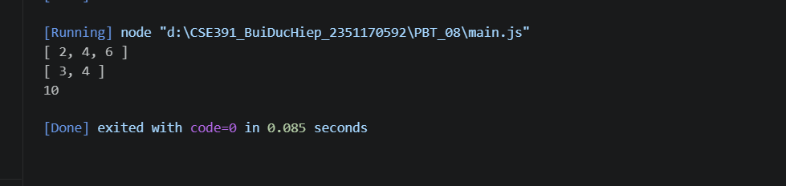

## PHẦN A 

### Câu A1

**1. Function Declaration:**
```javascript
function tinhThueBaoHiem_Decl(luong) {
    const thue = luong > 11000000 ? luong * 0.1 : 0;
    const thuc_nhan = luong - thue;
    return { thue, thuc_nhan }; // Giả định 'thuong' trong đề bài là typo của 'thue'
}
```

**2. Function Expression:**
```javascript
const tinhThueBaoHiem_Expr = function(luong) {
    const thue = luong > 11000000 ? luong * 0.1 : 0;
    const thuc_nhan = luong - thue;
    return { thue, thuc_nhan };
};
```

**3. Arrow Function:**
```javascript
const tinhThueBaoHiem_Arrow = (luong) => {
    const thue = luong > 11000000 ? luong * 0.1 : 0;
    const thuc_nhan = luong - thue;
    return { thue, thuc_nhan };
};
```

**Sự khác nhau về Hoisting:**
- **Function Declaration** được *hoisted hoàn toàn*. JavaScript sẽ đưa toàn bộ định nghĩa hàm lên đầu scope trước khi code chạy. Bạn có thể gọi hàm trước khi nó được viết trong code.
  ```javascript
  console.log(tinhThueBaoHiem_Decl(15000000)); // Chạy bình thường
  function tinhThueBaoHiem_Decl(luong) { ... }
  ```
- **Function Expression** và **Arrow Function** (sử dụng từ khóa `const` hoặc `let`) thì *không được hoisted phần giá trị* (chỉ hoisted phần tên biến vào Temporal Dead Zone). Bạn sẽ gặp lỗi ReferenceError nếu gọi hàm trước khi gán.
  ```javascript
  console.log(tinhThueBaoHiem_Arrow(15000000)); // Lỗi: Cannot access 'tinhThueBaoHiem_Arrow' before initialization
  const tinhThueBaoHiem_Arrow = (luong) => { ... }
  ```

---

### Câu A2

**Dự đoán output Đoạn 1:**
```javascript
console.log(c.increment());  // 1
console.log(c.increment());  // 2
console.log(c.increment());  // 3
console.log(c.decrement());  // 2
console.log(c.getCount());   // 2
```
*Giải thích:* Hàm `counter` tạo ra một Closure. Biến `count` nằm trong scope của `counter`, nhưng các hàm được return (`increment`, `decrement`, `getCount`) vẫn giữ được tham chiếu (ghi nhớ) biến `count` này kể cả sau khi hàm `counter` đã chạy xong. Do đó state của `count` được lưu lại qua các lần gọi hàm.

**Dự đoán output Đoạn 2:**
```javascript
// Output sau 100ms:
var: 3
var: 3
var: 3

// Output sau 200ms:
let: 0
let: 1
let: 2
```
*Giải thích chi tiết:*
- **Đối với `var`**: `var` có function-scope. Biến `i` là duy nhất cho toàn bộ hàm/file. Vòng lặp `for` chạy rất nhanh và tăng `i` lên 3, sau đó dừng lại. Khi các callback của `setTimeout` chạy sau 100ms, chúng đều trỏ đến cùng một ô nhớ của biến `i`, lúc này giá trị đã là 3.
- **Đối với `let`**: `let` có block-scope (phạm vi khối). Tại mỗi vòng lặp `for`, một "phiên bản" (binding) hoàn toàn mới của biến `j` được tạo ra riêng biệt. Các callback `setTimeout` sẽ "bắt" (capture) lấy giá trị `j` tĩnh tại đúng thời điểm của vòng lặp đó (0, 1, 2).

---
### Câu A3

```javascript
const nums = [1, 2, 3, 4, 5, 6, 7, 8, 9, 10];

// 1. Lấy các số chẵn
const evens = nums.filter(n => n % 2 === 0);

// 2. Nhân mỗi số với 3
const multiplied = nums.map(n => n * 3);

// 3. Tính tổng tất cả
const sum = nums.reduce((acc, curr) => acc + curr, 0);

// 4. Tìm số đầu tiên > 7
const firstOver7 = nums.find(n => n > 7);

// 5. Kiểm tra CÓ số > 10 không
const hasOver10 = nums.some(n => n > 10);

// 6. Kiểm tra TẤT CẢ đều > 0
const allPositive = nums.every(n => n > 0);

// 7. Tạo mảng "Số X là [chẵn/lẻ]"
const oddEvenStrings = nums.map(n => `Số ${n} là ${n % 2 === 0 ? 'chẵn' : 'lẻ'}`);

// 8. Đảo ngược mảng (không mutate gốc)
const reversed = [...nums].reverse(); // (Có thể dùng nums.slice().reverse() hoặc nums.toReversed() ở ES2023)
```

---

### Câu A4

**Dự đoán output Destructuring:**
```javascript
console.log(name, price, ram, color);  // "iPhone 16" 25990000 8 "Titan"
console.log(specs);                    // Lỗi: ReferenceError: specs is not defined
```
*Giải thích:* Khi thực hiện destructuring lồng nhau dạng `specs: { ram, color }`, JavaScript đi sâu vào object `specs` để lấy ra `ram` và `color` làm biến độc lập. Nó không tạo ra một biến riêng tên là `specs`.

**Dự đoán output Spread:**
```javascript
console.log(updated.price);            // 23990000
console.log(updated.sale);             // true
console.log(product.price);            // 25990000 (gốc không thay đổi)
```
*Giải thích:* Toán tử Spread (`...product`) tạo ra một object mới. Việc ta ghi đè `price` hoặc thêm `sale` trên `updated` sẽ không ảnh hưởng gì tới các thuộc tính nguyên thủy (primitive) của object gốc `product`.

**Dự đoán output Spread gotcha:**
```javascript
console.log(product.specs.ram);        // 16
```
*Giải thích (Tại sao lại là 16?):* Mặc dù Spread tạo ra object mới, nhưng nó chỉ là **Shallow Copy (Copy nông)**. Điều này có nghĩa là với các thuộc tính chứa object con (như `specs`), Spread chỉ copy địa chỉ tham chiếu (reference) trong bộ nhớ. Do đó, `copy.specs` và `product.specs` cùng trỏ chung vào một object lồng bên trong. Khi sửa `copy.specs.ram`, thuộc tính tương ứng trên object gốc cũng bị ảnh hưởng.

---

## PHẦN C — BÀI TẬP THỰC HÀNH

### Câu C1 (10đ) — Refactor Code

Dưới đây là đoạn code đã được refactor cực kỳ ngắn gọn (chỉ với 7 dòng) bằng cách kết hợp Chaining các Array Methods (`filter`, `map`, `sort`), Destructuring và Arrow functions:

```javascript
const processOrders = (orders) => orders
    .filter(({ status, total }) => status === "completed" && total > 100000)
    .map(({ id, customer, total }) => ({
        id, customer, total,
        discount: total * 0.1,
        finalTotal: total - (total * 0.1)
    }))
    .sort((a, b) => b.finalTotal - a.finalTotal);
```
*Giải thích:*
- Lọc (`filter`) ngay các order thoả mãn `completed` và `total > 100000` với Destructuring tham số đầu vào.
- Biến đổi (`map`) các phần tử thoả mãn sang dạng object mới có thêm `discount` và `finalTotal`.
- Sắp xếp giảm dần (`sort`) dựa trên giá trị `finalTotal` vừa tính.

---

### Câu C2 (10đ) — Thiết kế API

Triển khai thư viện JS nhỏ `miniArray` bằng vòng lặp `for` thuần tuý, tái tạo lại logic cốt lõi của các Array methods:
!

```javascript
const miniArray = {
    map(arr, fn) {
        let result = [];
        for (let i = 0; i < arr.length; i++) {
            result.push(fn(arr[i], i, arr));
        }
        return result;
    },
    
    filter(arr, fn) {
        let result = [];
        for (let i = 0; i < arr.length; i++) {
            if (fn(arr[i], i, arr)) {
                result.push(arr[i]);
            }
        }
        return result;
    },
    
    reduce(arr, fn, initialValue) {
        // Nếu không có initialValue, gán phần tử đầu tiên làm giá trị khởi tạo
        let acc = initialValue !== undefined ? initialValue : arr[0];
        // Nếu có initialValue thì lặp từ index 0, nếu không thì lặp từ index 1
        let startIndex = initialValue !== undefined ? 0 : 1;
        
        for (let i = startIndex; i < arr.length; i++) {
            acc = fn(acc, arr[i], i, arr);
        }
        return acc;
    }
};

// Test
console.log(miniArray.map([1,2,3], x => x * 2));           // Output: [2, 4, 6]
console.log(miniArray.filter([1,2,3,4], x => x > 2));      // Output: [3, 4]
console.log(miniArray.reduce([1,2,3,4], (a,b) => a+b, 0)); // Output: 10
```
